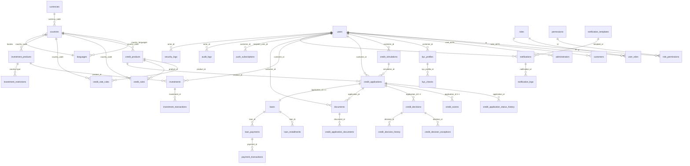

# KREDIT — Schéma PostgreSQL complet

> **Référence** : `database/schema.sql` (exécutable PG 15+) — ce document décrit la logique.  
> Stack : PostgreSQL 15 + `pgcrypto` (`gen_random_uuid()`), `citext` (email), `btree_gin` — `NUMERIC(15,2)` monétaire, `JSONB` i18n, hash chaîné append-only.

---

## 1. ERD logique (Mermaid)



**Lecture :** `countries` au centre — toute règle/produit/simulation/application porte `country_code` pour partition EU. `users` est racine IAM ; `customers`/`administrators` sont extensions **1-1** (profil RGPD chiffré vs employé). Le moteur crédit est **déterministe** : `simulation_snapshot` figé → `scoring` → `decision` → `exception` (si `REVIEW` forcé `APPROVED`). `loans` dérive 1-1 de l'application approuvée → `loan_installments` générées `term_months` → `loan_payments` idempotents → `payment_transactions` (provider). Investissements génériques avec `investment_restrictions` pays/type. `audit_logs`/`security_logs` **append-only** fédérés par `v_investigation(correlation_id)`.

---

## 2. Schéma relationnel (PK / FK)

| Domaine | Table | PK | FK principales | Relation |
|---|---|---|---|---|
| **Référentiel** | `currencies` | `code` | — | — |
| | `languages` | `code` | — | — |
| | `countries` | `code` | `currencies.code` | 1 pays → N langues via `country_languages` |
| | `country_languages` | `(country, language)` | `countries`, `languages` | junction |
| **IAM** | `users` | `id UUID` | — | base |
| | `roles` | `id` | `countries.code?` | global ou par pays |
| | `permissions` | `id` | — | — |
| | `role_permissions` | `(role, perm)` | `roles`, `permissions` | N-N |
| | `user_roles` | `(user, role)` | `users`, `roles` | N-N |
| | `customers` | `user_id` | `users.id` (1-1), `countries.code` | extension |
| | `administrators` | `user_id` | `users.id` (1-1) | extension |
| **Crédit** | `credit_products` | `id UUID` | `countries`, `users(created_by)` | versionné |
| | `credit_rules` | `id` | `credit_products?`, `countries`, `users` | règle `key` versionnée |
| | `credit_rate_rules` | `id` | `credit_products` | grille taux bande |
| | `credit_simulations` | `id` | `users?`, `credit_products?`, `credit_rate_rules?` | immutable |
| | `credit_applications` | `id` | `users`, `credit_products`, `credit_simulations?` | cœur |
| | `credit_application_status_history` | `id bigserial` | `credit_applications`, `users` | audit transition |
| | `credit_scores` | `id` | `credit_applications 1-1` | immutable |
| | `credit_decisions` | `id` | `credit_applications 1-1`, `users` | final ADMIN |
| | `credit_decision_exceptions` | `id` | `credit_decisions`, `credit_applications`, `credit_rules?` | garde trace |
| | `credit_decision_history` | `id bigserial` | `credit_decisions` | append-only |
| **Prêts** | `loans` | `id` | `credit_applications 1-1`, `users`, `credit_products` | disbursement |
| | `loan_installments` | `id` | `loans` | 1-N `term_months` |
| | `loan_payments` | `id` | `loans`, `users` | idempotent |
| | `payment_transactions` | `id` | `loan_payments` | provider |
| **Invest** | `investment_products` | `id` | `countries`, `users` | versionné |
| | `investment_restrictions` | `id` | `countries` | pays×type |
| | `investor_profiles` | `customer_id` | `users 1-1` | suitability |
| | `investments` | `id` | `users`, `investment_products` | souscription |
| | `investment_transactions` | `id` | `investments` | flux |
| **KYC** | `kyc_profiles` | `id` | `users 1-1 unique` | — |
| | `kyc_checks` | `id` | `kyc_profiles`, `users` | 1-N |
| **Docs** | `documents` | `id` | `users`, `credit_applications?`, `investments?`, `kyc_profiles?` | S3 |
| | `credit_application_documents` | `id` | `credit_applications`, `documents` | required_code |
| **Notif** | `notification_templates` | `id` | `users?` | (event,channel,locale,version) |
| | `notifications` | `id` | `users?`, `notification_templates?` | outbox idempotent |
| | `notification_logs` | `id bigserial` | `notifications` | provider logs |
| | `notification_preferences` | `customer_id` | `users 1-1` | RGPD consent |
| | `push_subscriptions` | `id` | `users` | — |
| **Audit** | `audit_logs` | `id bigserial` | `users?` | hash chaîné |
| | `security_logs` | `id bigserial` | `users?` | ISO 27001 |
| **Ops** | `rate_limit_counters` | `id bigserial` | — | — |
| | `backup_jobs` | `id bigserial` | — | PITR |

Toutes les tables portent `created_at TIMESTAMPTZ DEFAULT now()` + `updated_at` (trigger `set_updated_at()`) + `deleted_at` si soft-delete pertinent (`users`, `customers`, `credit_products`, `loans`, `investments`, `documents`, etc.). `version INT DEFAULT 1` + `effective_from/until` pour versionnage règles/produits.

---

## 3. SQL PostgreSQL complet

Voir **`database/schema.sql`** (750 lignes) — extrait principes :

```sql
CREATE EXTENSION IF NOT EXISTS "pgcrypto";
CREATE TYPE locale_code AS ENUM ('fr','en','nl','de');
CREATE TYPE currency_code AS ENUM ('EUR','GBP','CHF','USD','SEK','DKK','PLN','CZK');
-- … 25 ENUMs (voir schema.sql)
CREATE TABLE countries(code CHAR(2) PRIMARY KEY, currency_code currency_code REFERENCES currencies(code), ...);
CREATE TABLE users(id UUID PRIMARY KEY DEFAULT gen_random_uuid(), email CITEXT UNIQUE, ... deleted_at TIMESTAMPTZ);
CREATE TABLE credit_products(id UUID PRIMARY KEY, code TEXT, version INT, effective_from TIMESTAMPTZ, effective_until TIMESTAMPTZ, UNIQUE(code, version));
CREATE TABLE credit_rules(key TEXT, value JSONB, version INT, status rule_status, UNIQUE(key,country_code,product_type,version));
CREATE TABLE credit_decision_exceptions(reason TEXT CHECK (char_length(reason) BETWEEN 20 AND 2000), ...);
-- … loans, installments, payments (UNIQUE idempotency_key), investments, kyc, documents (CHECK mime/size/sha256), notifications, audit (trigger immutable)
```

**Types monétaires** : `NUMERIC(15,2)` (pas `float`/`double`), `NUMERIC(6,5)` pour taux/TAEG. **i18n** : `JSONB` `{"fr":"…","en":"…"}` + `locale_code[]`. **Chiffrement** : `*_encrypted TEXT` (`pgp_sym_encrypt`), `niss_hash` peppered, `sha256` documents.

---

## 4. Indexes

**Stratégie** : B-tree par défaut, GIN sur `JSONB`/`payload`, partiels `WHERE status='ACTIVE' AND deleted_at IS NULL` pour hot paths, uniques partielles pour soft-delete.

| Table | Index | Type | Justification |
|---|---|---|---|
| `users` | `uq_users_email_active ON (email) WHERE deleted_at IS NULL` | unique partiel | login BE, soft-delete autorise réinscription |
| `users` | `idx_users_niss_hash WHERE niss_hash IS NOT NULL` | btree | détection fraude NISS duplicate |
| `credit_products` | `idx_credit_products_country_type WHERE status='ACTIVE'` | partiel | lookup simulation 95% du trafic |
| `credit_rate_rules` | `idx_rate_rules_lookup (country, product_type, min_amount, max_amount, min_term, max_term) WHERE status='ACTIVE'` | btree | `getRateRule` bande |
| `credit_rules` | `idx_credit_rules_key (key, country_code, product_type) WHERE status='ACTIVE'` | btree | moteur règles hot |
| `credit_applications` | `uq_app_idempotency (customer_id, idempotency_key) WHERE idempotency_key IS NOT NULL` | unique | double soumission |
| `credit_applications` | `idx_applications_customer (customer_id, created_at DESC) WHERE deleted_at IS NULL` | btree | dashboard client |
| `credit_application_status_history` | `idx_hist_app (application_id, created_at DESC)` | btree | timeline |
| `loans` | `idx_loans_customer WHERE deleted_at IS NULL` | btree | portefeuille |
| `loan_installments` | `idx_installments_due (due_date) WHERE status IN ('DUE','OVERDUE')` | partiel | batch relance quotidien |
| `loan_payments` | `uq_loan_payments_idemp (idempotency_key)` + `idx_loan_payments_provider (provider_payment_id)` | unique/btree | idempotence + webhook routing |
| `documents` | `idx_docs_sha256`, `idx_docs_customer` | btree | déduplication, listing |
| `notifications` | `uq_notifications_idemp`, `idx_notifications_status (status, channel)` | unique/partiel | outbox worker |
| `audit_logs` | `idx_audit_entity (entity_type, entity_id, timestamp DESC)`, `idx_audit_correlation` | btree | investigation |
| `security_logs` | `idx_sec_ip`, `idx_sec_severity WHERE severity='CRITICAL'` | partiel | SIEM |

GIN : `idx_notifications_payload_gin ON notifications USING GIN(payload)` pour requêtes `payload @> '{"event":"…"}'`.

---

## 5. Contraintes

- **Domaine** : `CHECK (amount > 0)`, `CHECK (term_months BETWEEN 1 AND 360)`, `CHECK (risk_level BETWEEN 1 AND 7)`, `CHECK (mime IN ('application/pdf',…))`, `CHECK (size_bytes <= 10485760)`, `CHECK (char_length(reason) BETWEEN 20 AND 2000)` (exception), `CHECK (effective_until > effective_from)`, `CHECK (email ~* '^[^@]+@…')`.
- **Unicité versionnée** : `UNIQUE(code, version)` (produits/invest), `UNIQUE(key,country_code,product_type,version)` (rules) — autorise `v1 ACTIVE` + `v2 DRAFT` en parallèle.
- **FK** : `ON DELETE CASCADE` pour enfants forte dépendance (installments, history, checks), `ON DELETE RESTRICT` pour cœur (application→loan, user→application), `ON DELETE SET NULL` pour audit (`verified_by`, `actor_id`).
- **Soft-delete** : `deleted_at TIMESTAMPTZ` + uniques partielles `WHERE deleted_at IS NULL` + vue `WHERE deleted_at IS NULL` par défaut (RLS ou filtre applicatif).
- **Optimistic locking** : `credit_applications.version INT` + `WHERE version = :expected` → `409 Conflict` si stale.
- **Immutabilité** : triggers `BEFORE UPDATE OR DELETE` sur `audit_logs`, `security_logs`, `notification_logs` → `RAISE EXCEPTION 'append-only'`.

---

## 6. Stratégie de migration

- **Outil** : `TypeORM migrations` versionnées `database/migrations/001…` + `database/schema.sql` comme snapshot (généré `pg_dump --schema-only` à chaque release). CI vérifie `schema.sql` = `migrations` appliquées (dry-run).
- **Versionnage règles/produits** : jamais `UPDATE` in-place d'une règle `ACTIVE`. Workflow : `INSERT v2 DRAFT` → `legal_validation` → `UPDATE v1 SET effective_until=now(), status='ARCHIVED'` → `UPDATE v2 SET status='ACTIVE', effective_from=now()`. L'historique reste requêtable `WHERE key='max_debt_ratio' ORDER BY version`.
- **Blue-green** : migrations `ADD COLUMN … DEFAULT`, `CREATE INDEX CONCURRENTLY`, `ALTER TYPE … ADD VALUE` (jamais `DROP ENUM` en prod). Down migrations interdites en prod — rollback = nouveau `v+1`.
- **Seeds** : `database/seeds/001_countries_BE.sql` idempotent `ON CONFLICT DO NOTHING` ; produits/règles BE seedés via `INSERT … ON CONFLICT (code,version) DO UPDATE` en `staging` puis promus.
- **EU extension** : ajouter `FR/NL/DE` = `INSERT INTO countries …` + `INSERT INTO credit_products (country_code='FR', version=1, effective_from=…)` + `INSERT INTO credit_rate_rules …` — zéro code.

---

## 7. Stratégie de sauvegarde (RPO 15 min / RTO 1 h)

| Couche | Outil | Fréquence | Rétention | Chiffrement | Test |
|---|---|---|---|---|---|
| **PostgreSQL** | `pg_basebackup` + `WAL archiving` vers `s3://kredit-backups/pg/` (`wal-g`) | base quotidien 03:00 Brussels, WAL continu | 30 j (prod), 7 j (staging) | SSE-KMS `kredit-pg` | `dr_tests` `FULL_RESTORE` mensuel |
| **S3/Minio docs** | `s3 sync` versionné + `Object Lock` | continu | 90 j versioning | SSE-KMS `kredit-docs` | restore spot-check hebdo |
| **Redis** | `BGSAVE` RDB → S3 | 6 h | 7 j | KMS | — |
| **Secrets** | `secret_rotations` journal + Vault backup | à chaque rotation 90 j | illimité | HSM | — |

`backup_jobs` logge chaque job (`type, status, location, checksum, pitr_target`). `PITR` : `recovery_target_time = now() - '15 minutes'` testé en `preview` (Docker). RPO mesuré via lag `pg_stat_archiver`.

---

## 8. Stratégie d'audit

**Principes** : *append-only*, *hash chaîné*, *corrélable*, *RGPD-redacted*.

- **Capture** : middleware `correlation.middleware` injecte `X-Request-Id` → `audit_logs.correlation_id` + `security_logs.correlation_id`. Decorator `@AuditAction('application.approve')` + interceptor enregistre `before`/`after` (diff `JSONB`, mots de passe/NISS jamais en clair — `[REDACTED]`).
- **Hash** : `hash = sha256(prev_hash || actor || action || entity_type || entity_id || after::text || timestamp)` stocké `hash, prev_hash`. Vérification `SELECT verifyChain()` détecte tampering. `REVOKE UPDATE/DELETE` sur rôle `kredit_app` + trigger `audit_no_update_delete()`.
- **Logs** : `audit_logs` (métier) + `security_logs` (ISO 27001 : `LOGIN_FAILED`, `BRUTE_FORCE`, `ANOMALY_…`, `SECRET_ROTATED`). Vue `v_investigation` `UNION ALL` filtrable `WHERE correlation_id='req_abc' OR ip='1.2.3.4'`.
- **Accès** : `audit.read` permission → seuls `ADMIN/SUPER_ADMIN` + `COMPLIANCE` via `GET /admin/audit-logs?entity_type=APPLICATION&entity_id=…&correlation_id=…`. Rétention 10 ans (WORM S3 via `pg_dump` annuel vers `s3://kredit-audit/year=…/`).
- **Alertes** : `siem.service` pousse `security_logs severity='CRITICAL'` vers SIEM/Webhook + `alert.service` email `security@kredit.be`.

---

## Annexe — ENUMs & conventions

- **Locales** `fr,en,nl,de` — `countries.locales` + `country_languages` (défaut `BE.fr`). **Devises** `currencies` — `EUR` par défaut, `countries.currency_code` FK.
- **Timestamps** `TIMESTAMPTZ` (UTC stockage, affichage `Europe/Brussels` via `Intl.DateTimeFormat`).
- **Monétaire** `NUMERIC(15,2)` + `Decimal.js HALF_UP` applicatif (`MoneyRules`).
- **Soft-delete** : requêtes filtrent `WHERE deleted_at IS NULL` (TypeORM `@DeleteDateColumn`).

> Exécuter : `psql $DATABASE_URL -f database/schema.sql` puis `npm run seed` (countries, rôles, produits BE). Vérifier : `SELECT * FROM v_investigation LIMIT 5;` et `SELECT verify_audit_chain();`.
